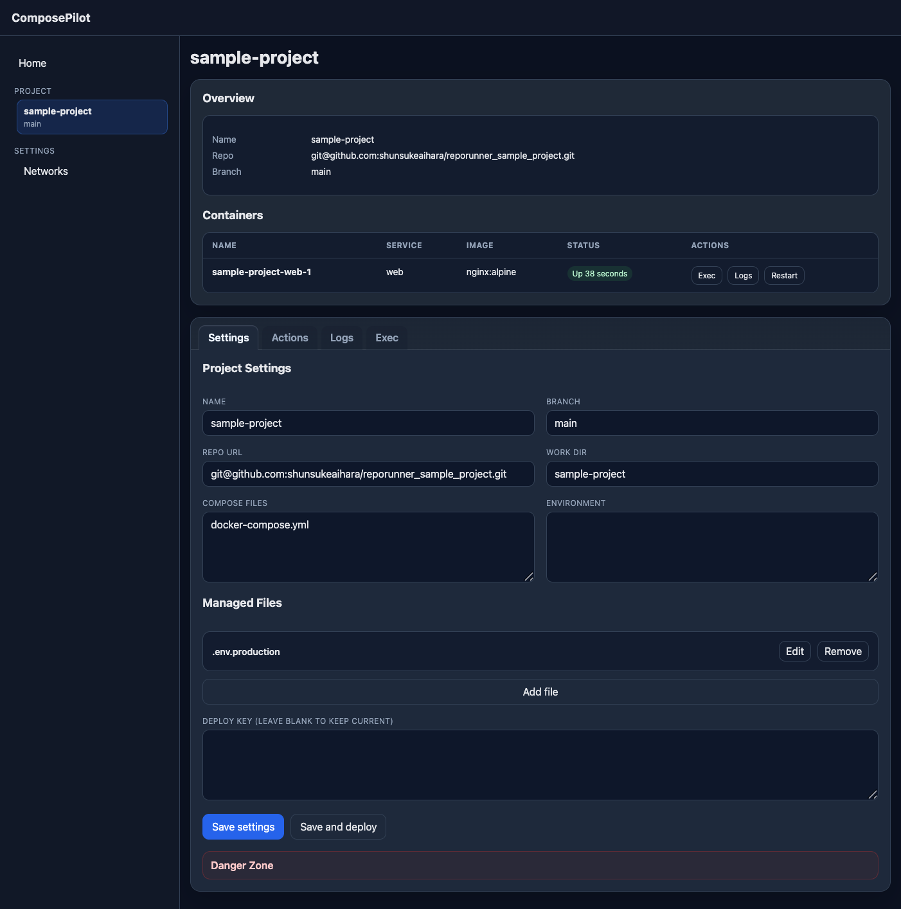

# ComposePilot

ComposePilot is a single-binary Go control plane for managing GitHub-hosted Docker Compose applications on a single Docker host.



## Features
- Register repositories with branch, deploy key, compose files, and environment variables
- Clone/pull repositories over SSH using per-service deploy keys
- Run `docker compose build`, `up -d`, and `restart`
- View compose containers, stream/search logs, and open interactive `docker exec` sessions from the browser
- List and create Docker networks
- Persist service config and job history in SQLite with AES-GCM encrypted secrets

## Run locally
1. Copy `.env.example` to `.env`.
2. Put a base64-encoded 32-byte key in either `COMPOSEPILOT_MASTER_KEY` or a file pointed to by `COMPOSEPILOT_MASTER_KEY_FILE`.
3. Start the server:

```bash
go run ./cmd/composepilot -listen :8080 -data-dir ./data -workspace ./workspace
```

ComposePilot automatically loads `.env` from the repo root if it exists.

## Install from GitHub Releases
For a one-shot install on Linux, use:

```bash
curl -fsSL https://raw.githubusercontent.com/shunsukeaihara/ComposePilot/main/install.sh | sudo sh
```

Behavior:
- Downloads the latest GitHub Release binary for the current OS/arch
- Installs `composepilot` to `/usr/local/bin`
- Generates a master key file if needed
- Creates the `composepilot` user if it does not exist
- Adds `composepilot` to the `docker` group when that group exists
- Registers and starts a `systemd` service

Optional overrides:

```bash
curl -fsSL https://raw.githubusercontent.com/shunsukeaihara/ComposePilot/main/install.sh | \
  sudo COMPOSEPILOT_VERSION=v0.1.0 COMPOSEPILOT_LISTEN=:9090 sh
```

Installer variables and defaults:

| Variable | Default |
| --- | --- |
| `COMPOSEPILOT_VERSION` | latest release tag |
| `COMPOSEPILOT_LISTEN` | `:8080` |
| `COMPOSEPILOT_BIN_DIR` | `/usr/local/bin` |
| `COMPOSEPILOT_CONFIG_DIR` | `/etc/composepilot` |
| `COMPOSEPILOT_DATA_DIR` | `/var/lib/composepilot` |
| `COMPOSEPILOT_WORKSPACE_DIR` | `${COMPOSEPILOT_DATA_DIR}/workspace` |

Notes:
- The SQLite database path is fixed to `${COMPOSEPILOT_DATA_DIR}/composepilot.db`
- The master key file path is fixed to `${COMPOSEPILOT_CONFIG_DIR}/master_key`
- The environment file path is fixed to `${COMPOSEPILOT_CONFIG_DIR}/composepilot.env`
- `install.sh` currently supports Linux only

## Auto-reload with air
1. Install `air`:

```bash
go install github.com/air-verse/air@latest
```

2. Copy `.env.example` to `.env` and set your key.
3. Start the watcher from the repo root:

```bash
air
```

This repo includes a ready-to-use `.air.toml` that rebuilds on `.go` and embedded `.html` changes and restarts ComposePilot on `:8080`.

## Build release binaries
Use the included `Makefile` to cross-compile binaries into `dist/`.

```bash
make dist VERSION=0.1.0
```

Available targets:
- `make dist-linux`
- `make dist-windows`
- `make dist-darwin`
- `make dist-linux-amd64`
- `make dist-linux-arm64`
- `make dist-windows-amd64`
- `make dist-darwin-amd64`
- `make dist-darwin-arm64`

The binary also supports:

```bash
./dist/composepilot-linux-amd64 -version
```

## Publish GitHub release binaries
Pushing a tag like `v0.1.0` triggers GitHub Actions to build release archives and upload them to the matching GitHub Release.

```bash
git tag v0.1.0
git push origin v0.1.0
```

The installer script resolves the latest release automatically, or uses `COMPOSEPILOT_VERSION` when specified.

## Production secret handling
Recommended order:
1. Use `COMPOSEPILOT_MASTER_KEY_FILE` pointing to a root-owned file with `chmod 600`
2. Provide that via a process manager such as `systemd`
3. Avoid putting the raw key directly in the shell command line

Sample files are included:
- `deploy/systemd/composepilot.service`
- `deploy/systemd/composepilot.env.example`

Example setup:

```bash
sudo install -d -m 700 /etc/composepilot
sudo install -m 600 deploy/systemd/composepilot.env.example /etc/composepilot/composepilot.env
sudo sh -c 'printf "%s\n" "<base64-key>" > /etc/composepilot/master_key'
sudo chmod 600 /etc/composepilot/master_key
sudo install -m 644 deploy/systemd/composepilot.service /etc/systemd/system/composepilot.service
sudo systemctl daemon-reload
sudo systemctl enable --now composepilot
```

## Notes
- Docker CLI and `docker compose` must be available to the ComposePilot process.
- The process user needs permission to access Docker.
- This repository contains a minimal embedded UI in `internal/http/templates`.
